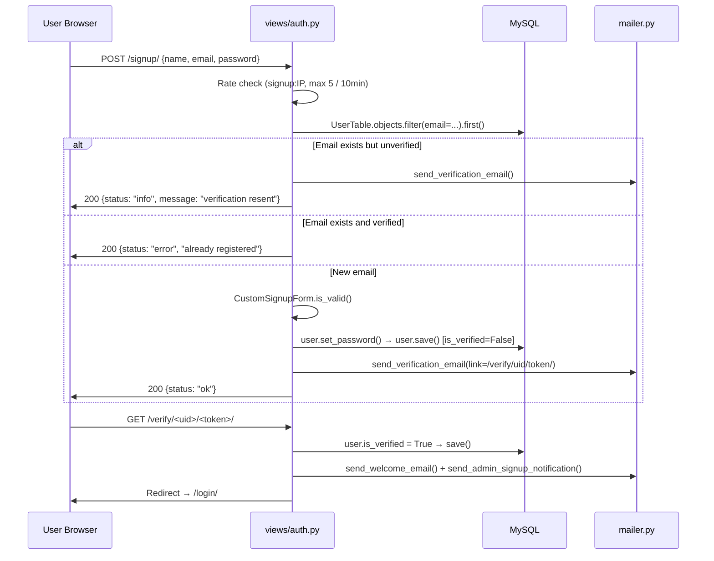
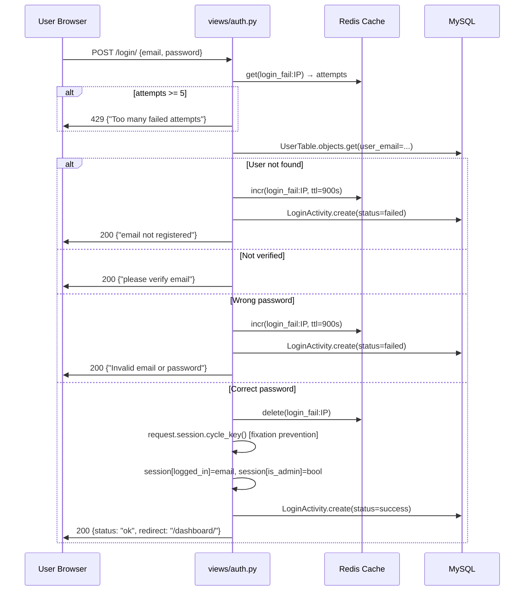
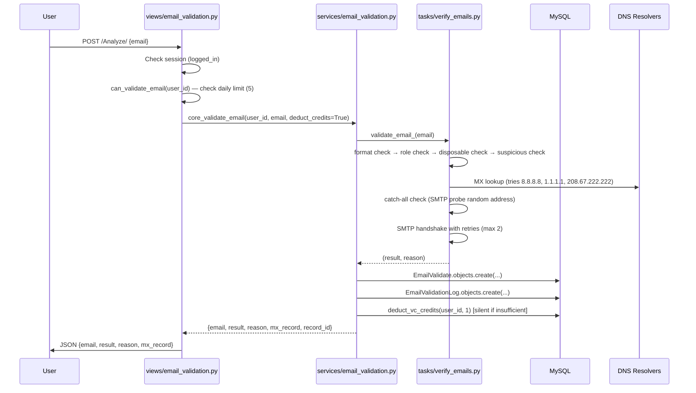
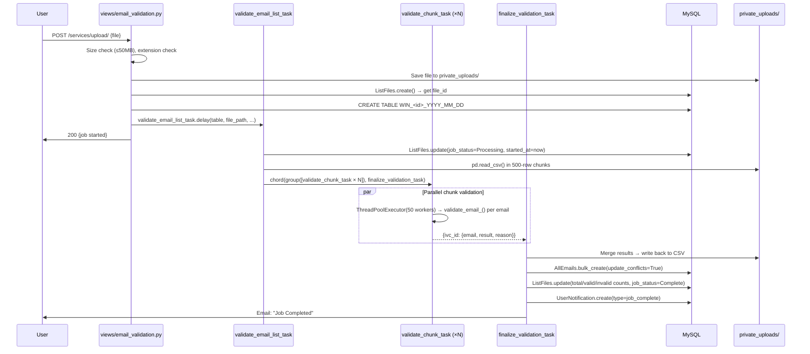
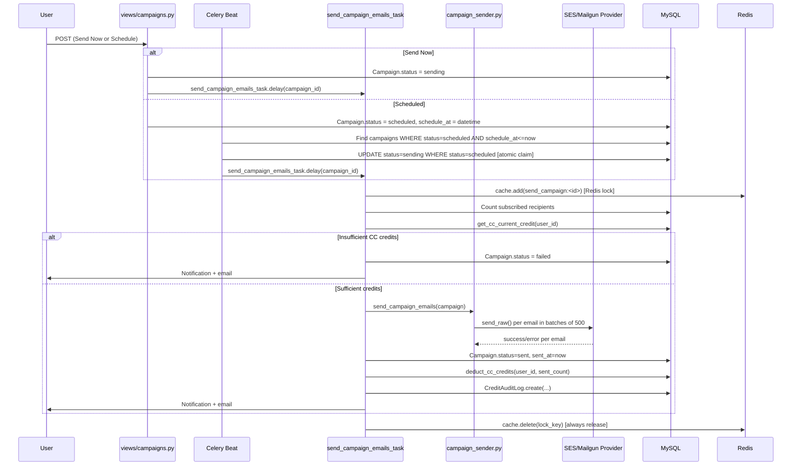
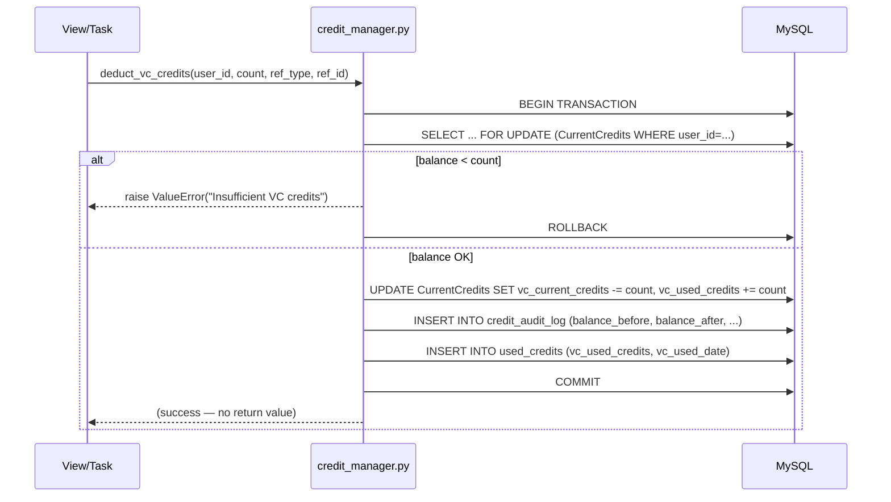

# Waytoinbox — Project Knowledge Base

> **Last updated:** 2026-08-04  
> **Django version:** 6.0.3 | **Python:** 3.13 | **Database:** MySQL | **Queue:** Celery + Redis

---

## Table of Contents

1. [Project Overview](#1-project-overview)
2. [Services Overview](#2-services-overview)
3. [Complete Page Inventory](#3-complete-page-inventory)
4. [Authentication & Access Control](#4-authentication--access-control)
5. [Navigation Structure](#5-navigation-structure)
6. [Credit System](#6-credit-system)
7. [Notifications System](#7-notifications-system)
8. [Background Tasks (Celery)](#8-background-tasks-celery)
9. [Scheduled Jobs](#9-scheduled-jobs)
10. [Email Infrastructure](#10-email-infrastructure)
11. [Analytics & Reports](#11-analytics--reports)
12. [User Account System](#12-user-account-system)
13. [Third-Party Tools & Integrations](#13-third-party-tools--integrations)
14. [Business Rules](#14-business-rules)
15. [Search, Filters & Exports](#15-search-filters--exports)
16. [File Management](#16-file-management)
17. [Error Handling](#17-error-handling)
18. [Audit, Logs & History](#18-audit-logs--history)
19. [Permissions Matrix](#19-permissions-matrix)
20. [Data Flow Diagrams](#20-data-flow-diagrams)
21. [Current Status](#21-current-status)
22. [Lessons Learned](#22-lessons-learned)
23. [System Inventory](#23-system-inventory)
24. [Project Map](#24-project-map)

---

## 1. Project Overview

### Purpose
Waytoinbox is a **SaaS email deliverability platform**. It gives businesses the tools to ensure their emails actually reach the inbox — by validating email lists, monitoring sender reputation, analyzing email headers, checking blocklists, and sending campaigns through verified domains.

### Business Goals
- Reduce email bounce rates for customers by verifying lists before sending
- Help senders maintain a good reputation with ISPs (Gmail, Yahoo, Outlook)
- Provide campaign sending with tracking, scheduling, and analytics
- Monetize via pay-as-you-go (PAYG) credit purchases and monthly/yearly subscriptions

### Main Features

| Feature | Description |
|---|---|
| Single Email Verification | Validate one email address instantly (SMTP check, MX lookup) |
| Bulk Email Verification | Upload CSV/XLSX/JSON/TXT file; Celery validates asynchronously |
| IP Blocklist Monitor | Monitor up to N IP addresses against DNSBL lists daily |
| Domain Blocklist Monitor | Monitor domains against domain-based blocklists daily |
| Email Header Analysis | Paste raw email headers; get SPF/DKIM/DMARC result and risk score |
| DMARC Checker | Look up a domain's SPF, DKIM, and DMARC DNS records |
| Sender Reputation | Monitor sending domain's reputation via Google Postmaster Tools |
| Email Campaigns | Build, schedule, and send HTML email campaigns to contact lists |
| Contact Lists | Import and manage subscriber lists; segment by rules |
| Template Builder | Drag-and-drop (WTI Builder) HTML email template creator |
| API Access | REST API with X-API-Key authentication for programmatic access |
| Billing / Subscription | Razorpay-powered PAYG credit purchases and subscription plans |

### User Journey
1. User signs up → receives email verification link → verifies → logs in
2. User lands on Dashboard → sees credit balance and job history
3. User uploads a CSV → Celery validates all emails in the background → user downloads results
4. User optionally purchases credits (PAYG) or a subscription plan via Razorpay
5. User adds a sender domain → verifies DNS (DKIM tokens) → sends campaigns to contact lists
6. User monitors their IP/domain reputation → gets alerted if listed on a blocklist

### Overall Architecture

```
Browser → nginx (TLS termination) → gunicorn (Django) → MySQL (primary DB)
                                          ↓
                                       Redis
                                    ├── Cache (DB 2): sessions, rate-limit counters, MX cache
                                    ├── Broker (DB 0): Celery task queue
                                    └── Results (DB 1): Celery task results (expire 1h)
                                          ↓
                                    Celery Worker
                                    ├── validate_email_list_task (bulk validation)
                                    ├── send_campaign_emails_task (campaign sending)
                                    └── sync_campaign_events (CloudWatch sync)
                                          ↓
                                    Celery Beat (scheduler)
                                    ├── send_scheduled_campaigns (every minute)
                                    ├── sync_campaigns_cloudwatch (every 5 min)
                                    ├── scheduler_job — IP blocklist (daily 1:00 AM)
                                    ├── my_second_job — domain blocklist (daily 1:30 AM)
                                    ├── update_all_reputations (daily 2:00 AM)
                                    ├── subscription_expiry_job (daily 2:30 AM)
                                    ├── bl_notification_job (daily 3:00 AM)
                                    └── clearsessions_task (daily 5:00 AM)
```

**External Services:**
- **AWS SES** — Transactional campaign email sending + CloudWatch event tracking
- **Mailgun** — Alternative campaign provider (switchable via `EMAIL_PROVIDER` env var)
- **Razorpay** — Payment gateway (India-based, supports INR + USD)
- **Google Postmaster Tools** — Sender domain reputation data via OAuth2

---

## 2. Services Overview

### 2.1 Email Validation Service
**File:** `services/email_validation.py`, `tasks/verify_emails.py`

**Purpose:** Validate whether an email address is deliverable by checking format, DNS MX records, SMTP handshake, and heuristic rules.

**Problem it solves:** Sending to invalid addresses harms sender reputation and wastes campaign credits.

**User workflow:**
1. User uploads a file on the Bulk Verify page
2. File is saved to `private_uploads/` (never web-accessible)
3. A `ListFiles` DB record is created; a dynamic `WIN_<id>_YYYY_MM_DD` table is created in MySQL
4. `validate_email_list_task` Celery task is dispatched
5. Task splits the file into 500-email chunks, fans out `validate_chunk_task` tasks in parallel
6. `finalize_validation_task` (chord callback) merges results, upserts `AllEmails`, marks job Complete
7. User is notified by email and in-app notification
8. User returns to the Bulk Verify page and downloads filtered results (Valid/Invalid)

**Validation pipeline (per email, in `validate_email_` function):**
1. Format check — regex `^[a-zA-Z0-9_.+-]+@[a-zA-Z0-9-]+\.[a-zA-Z0-9-.]+$`
2. Role-based check — if local part is admin/info/support/sales/billing → "Others"
3. Disposable domain check — known temp-mail services → "Risky"
4. Blacklisted domain check — hardcoded set → "Others"
5. Suspicious pattern check — contains 123/test/fake/noreply/random → "Risky"
6. MX record lookup via DNS (tries 8.8.8.8, 1.1.1.1, 208.67.222.222) — cached in Redis 1hr
7. Catch-all domain check (probes random email; if accepted → "Risky")
8. SMTP handshake via `check_smtp_with_retries_` — max 2 retries per MX server
9. Provider-rule fallback for Yahoo/AOL/Outlook/Hotmail if SMTP fails (username length heuristic)

**Result values:** `Valid`, `Invalid`, `Risky`, `Others`

**Credits used:** 1 VC credit per email at download time (not at validation time). The `manage_credits()` function deducts `valid_count + invalid_count` credits when the user first downloads results. If already credited (`credite_status = "Credited"`), re-download is free.

**Related models:** `ListFiles`, `AllEmails`, `EmailValidate`, `EmailValidationLog`, `CurrentCredits`

**Related tasks:** `validate_email_list_task`, `validate_chunk_task`, `finalize_validation_task`

---

### 2.2 Single Email Verification Service
**File:** `services/email_validation.py` (`core_validate_email`), `views/api.py`, `views/email_validation.py`

**Purpose:** Instantly validate a single email address (website and API).

**Business rules:**
- Free users: max 5 single validations per day (tracked in `EmailValidationLog`, window resets at midnight UTC)
- API users: no daily limit (governed by API credits — currently not enforced at credit level)
- Result is stored in `EmailValidate` table regardless of credit availability
- Website validates with `deduct_credits=True`; API validates with `deduct_credits=False`

**Credits used:** 1 VC credit deducted via `deduct_vc_credits()` — but failure to deduct (insufficient credits) does NOT block the validation; it just skips silently.

---

### 2.3 Campaign Sending Service
**File:** `services/campaign_sender.py`, `tasks/send_scheduled_campaigns.py`

**Purpose:** Send HTML email campaigns to subscriber lists or segments via AWS SES or Mailgun.

**User workflow:**
1. User creates a campaign (name, list/segment, template, from-email, reply-to)
2. User optionally schedules it or clicks "Send Now"
3. On Send Now: `send_campaign_emails_task.delay(campaign.id)` is called immediately
4. On schedule: Celery Beat's `send_scheduled_campaigns` picks it up every minute
5. Before sending: CC credit preflight — if `cc_available < recipient_count`, campaign is marked `failed`
6. Emails are sent in batches of 500 (configurable via `EMAIL_BATCH_SIZE`) with 60s inter-batch delay
7. Each email gets an unsubscribe link injected (signed token via `django.core.signing`)
8. After all batches: campaign status → `sent`, CC credits are deducted, CloudWatch sync triggered

**Retry logic:**
- Per-email: up to 3 retries with 30s delay (`EMAIL_BATCH_RETRY_COUNT`, `EMAIL_BATCH_RETRY_DELAY`)
- Task-level: up to 2 Celery retries with 60s countdown on unexpected errors

**Race condition prevention:**
- Redis lock `send_campaign:<id>` (TTL 10 min) prevents two workers from sending the same campaign
- Atomic `UPDATE ... WHERE status='scheduled'` claim prevents double-dispatch from Beat

**Credits used:** 1 CC credit per recipient, deducted after successful send via `deduct_cc_credits()`

**Related models:** `Campaign`, `CampaignList`, `CampaignEmail`, `CampaignStats`, `CampaignEvent`, `Segment`

---

### 2.4 Credit Manager Service
**File:** `services/credit_manager.py`

**Purpose:** All credit operations — add, deduct, expire — with full audit trail and race-condition safety.

**Three credit types:**
- **VC (Validation Credits)** — used for bulk email downloads and single validations
- **AC (Analysis Credits)** — used for IP/domain/header/reputation checks; subscription-only
- **CC (Contact Credits)** — used for campaign sends (1 per recipient); subscription-only

**How deduction works (all three types use same pattern):**
```python
with transaction.atomic():
    obj = CurrentCredits.objects.select_for_update().get(user_id=user_id)
    # check balance → deduct → save → write CreditAuditLog → write UsedCredits
```
`select_for_update()` holds a row-level DB lock so concurrent deductions never produce a negative balance.

**Expiry:** `expire_subscription_credits()` resets AC and CC to 0 when a subscription expires. VC credits do NOT expire (they are purchased separately).

**Pricing tiers (PAYG VC credits):**

| Credits | Rate per credit |
|---|---|
| Up to 5,000 | $0.007 |
| Up to 50,000 | $0.004 |
| Up to 100,000 | $0.003 |
| Up to 500,000 | $0.002 |
| Up to 1,000,000 | $0.0024 |
| Up to 2,000,000 | $0.001 |
| Over 2,000,000 | Contact sales |

---

### 2.5 IP Blocklist Monitor Service
**File:** `services/monitor.py`, `tasks/scheduler_job.py`

**Purpose:** Monitor user-added IP addresses against DNSBL (DNS-based blocklist) providers daily.

**User workflow:**
1. User adds an IP address on the IP Blocklist page
2. Every day at 1:00 AM UTC, `scheduler_job` Celery task runs
3. For each `BlocklistMonitor` record, `ip_blacklists(ip)` queries all configured DNSBL providers
4. Results saved to `BlacklistStatus`; any "Listed" results also saved to `BlacklistListed`
5. At 3:00 AM UTC, `bl_notification_job` aggregates listed IPs and sends email notifications

**Related models:** `BlocklistMonitor`, `Blacklists`, `BlacklistStatus`, `BlacklistListed`

---

### 2.6 Domain Blocklist Monitor Service
**File:** `services/monitor.py`, `tasks/scheduler_job.py` (`my_second_job`)

**Purpose:** Same as IP Blocklist Monitor but for domain names.

**Related models:** `DomainBlocklist`, `DomainBlacklists`, `DomainBlacklistStatus`, `DomainBlacklistListed`

---

### 2.7 Email Header Analysis Service
**File:** `services/email_analyzer.py`, `views/blocklist.py`

**Purpose:** Parse raw email headers pasted by the user and extract SPF/DKIM/DMARC authentication results, origin IP, spam score, and overall risk level.

**Output fields:** `origin_ip`, `from_email`, `to_email`, `subject`, `spf_status`, `dkim_status`, `dmarc_status`, `spam_score`, `risk_level` (SAFE / RISKY / DANGEROUS)

**Credits used:** 1 AC credit per analysis

**Related model:** `EmailHeader`

---

### 2.8 DMARC Checker Service
**File:** `services/dmarc_checker.py`, `views/dmarc.py`

**Purpose:** Look up a domain's SPF, DKIM, and DMARC DNS records and assess compliance.

**Output:** SPF record + includes, DMARC record + policy + alignment + reporting URIs, DKIM selector + record

**Related model:** `DMARCAnalysis`

---

### 2.9 Sender Domain / DKIM Service
**File:** `services/sender_domain.py`, `services/dkim_config.py`, `views/sender_verify.py`

**Purpose:** Allow users to add a sender domain, register it with SES and/or Mailgun, generate DKIM tokens, and verify DNS setup.

**Workflow:**
1. User adds domain → registered with both SES and Mailgun simultaneously
2. DKIM tokens generated and stored in `SenderDomain.ses_dkim_tokens` / `mailgun_dkim_tokens`
3. User adds CNAME records to their DNS
4. User clicks "Verify" → system queries SES/Mailgun to check verification status
5. On success: `SenderDomain.status = 'verified'`, notification + email sent

**Related model:** `SenderDomain`, `SenderEmailToken`

---

### 2.10 Sender Reputation Service
**File:** `services/postmaster.py`, `tasks/update_reputations.py`, `views/reputation.py`

**Purpose:** Fetch domain reputation data from Google Postmaster Tools via OAuth2 and store daily snapshots.

**Data collected:** `spam_rate`, `domain_reputation` (HIGH/MEDIUM/LOW/BAD), `ip_reputation` (per IP), `delivery_errors`

**Schedule:** Daily at 2:00 AM UTC via `update_all_reputations` Celery task

**Related models:** `Reputation`, `ReputationResults`

---

### 2.11 API Authentication Service
**File:** `services/api_auth.py`

**Purpose:** Authenticate external API requests via `X-API-Key` header (NOT query parameter).

**How it works:**
1. Decorator `@require_api_key` wraps API views
2. Extracts key from `X-API-Key` header
3. Computes `SHA-256(key)` → looks up `APIKey.key_hash` in DB (never compares raw key)
4. Returns `401` if key missing, invalid, or `is_active=False`
5. Injects `request.api_user` for use in the view

**Related model:** `APIKey`

---

### 2.12 Segment Builder Service
**File:** `services/segment_builder.py`

**Purpose:** Filter contacts from a `CampaignList` based on rule sets (field/operator/value conditions) for targeted campaign sending.

**Rule format stored in `Segment.rules`:**
```json
{"conditions": [{"field": "subscribed", "operator": "eq", "value": "subscribed"}]}
```

**Match types:** `all` (AND logic), `any` (OR logic)

---

## 3. Complete Page Inventory

### Page Summary Table

| Page Name | URL | Template | View | Login Required | Credits Required |
|---|---|---|---|---|---|
| Landing / Home | `/` | `i_home.html` / `i_index.html` | `auth.home` | No | No |
| Signup | `/signup/` | `i_signup.html` | `auth.signup` | No | No |
| Login | `/login/` | `i_login.html` | `auth.login` | No | No |
| Forgot Password | `/forgot-password/` | `i_forgot_password.html` | `auth.forgot_password` | No | No |
| Reset Password | `/reset-password/<token>/` | `i_reset_password.html` | `auth.reset_password` | No | No |
| Email Verify | `/verify/<uidb64>/<token>/` | — (redirect) | `auth.verify_email` | No | No |
| Dashboard | `/dashboard/` | `i_Dashboard.html` | `dashboard.dashboard` | Yes | No |
| Bulk Email Verify | `/services/` | `i_bulk_email_verify.html` | `auth.services` | Yes | Yes (VC at download) |
| Single Email Verify | `/Analyze/` | `i_email_verify.html` | `email_validation.Analyze` | Yes | Yes (1 VC) |
| Billing / Pricing | `/pricing/` | `i_pricing.html` | `billing.pricing` | Yes | No |
| Payment | `/pricing/payment/` | `i_payment.html` | `billing.billing` | Yes | No |
| Invoice | `/invoice/` | `i_invoice.html` | `billing.invoice` | Yes | No |
| Subscription | `/subscription/` | `i_subscription.html` | `subscription.subscription` | Yes | No |
| Profile | `/profile/` | `i_profile.html` | `profile.profile` | Yes | No |
| IP Blocklist | `/services/ip-blocklist/` | `i_ip_blocklist.html` | `blocklist.ip_blocklist` | Yes | Yes (AC) |
| Domain Blocklist | `/services/domain-blocklist/` | `i_domain_blocklist.html` | `blocklist.domain_blocklist` | Yes | Yes (AC) |
| Header Analysis | `/services/header-analysis/` | `i_header_analysis.html` | `blocklist.header_analysis` | Yes | Yes (AC) |
| DMARC Check | `/services/dmarc-check/` | `i_dmarc_check.html` | `dmarc.dmarc_check` | Yes | Yes (AC) |
| Reputation Analysis | `/Email_Campaigns/reputation/` | `i_Reputation_Analysis.html` | `reputation.reputation_analysis` | Yes | Yes (AC) |
| Reputation Detail | `/Email_Campaigns/reputation/<id>/` | `i_Reputation_Detail.html` | `reputation.reputation_detail` | Yes | No |
| Campaigns List | `/Email_Campaigns/campaigns/` | `i_Campaigns.html` | `campaigns.campaigns` | Yes | No |
| Create Campaign | `/Email_Campaigns/create/` | `i_Create_Campaign.html` | `campaigns.create_campaign` | Yes | Yes (CC) |
| Campaign Detail | `/Email_Campaigns/campaigns/<id>/` | `i_Campaign_Detail.html` | `campaigns.campaign_detail` | Yes | No |
| Contact Lists | `/contacts/lists/` | `i_List_Segment.html` | `contacts.campaign_lists` | Yes | No |
| All Contacts | `/contacts/all/` | `i_All_Contacts.html` | `contacts.all_contacts` | Yes | No |
| Campaign Contacts | `/contacts/list/<id>/` | `i_Campaign_Contacts.html` | `contacts.campaign_list_detail` | Yes | No |
| Segments | `/segments/` | `i_Segments.html` | `segments.segments` | Yes | No |
| Segment Builder | `/segments/builder/<id>/` | `i_Segment_Builder.html` | `segments.segment_builder` | Yes | No |
| Segment Contacts | `/segments/<id>/contacts/` | `i_Segment_Contacts.html` | `segments.segment_contacts` | Yes | No |
| Templates | `/Email_Campaigns/templates/` | `i_Templates.html` | `templates.templates_page` | Yes | No |
| Template Builder | `/Email_Campaigns/templates/builder/` | `i_Template_Builder.html` | `templates.template_builder` | Yes | No |
| Sender Verify | `/sender-verify/` | `i_Sender_Verify.html` | `sender_verify.sender_verify` | Yes | No |
| Sender DNS Guide | `/sender-verify/<id>/dns/` | `i_Sender_Verify_DNS.html` | `sender_verify.sender_verify_dns` | Yes | No |
| Analytics Overview | `/analytics/` | `i_analytics_overview.html` | `analytics.analytics_overview` | Yes | No |
| Email Analytics | `/analytics/email/` | `i_email_analytics.html` | `analytics.email_analytics` | Yes | No |
| Campaign Analytics | `/analytics/campaigns/` | `i_campaign_analytics.html` | `analytics.campaign_analytics` | Yes | No |
| Reputation Analytics | `/analytics/reputation/` | `i_reputation_analytics.html` | `analytics.reputation_analytics` | Yes | No |
| Blocklist Analytics | `/analytics/blocklist/` | `i_blocklist_analytics.html` | `analytics.blocklist_analytics` | Yes | No |
| Header Analytics | `/analytics/headers/` | `i_header_analysis_analytics.html` | `analytics.header_analytics` | Yes | No |
| DMARC Analytics | `/analytics/dmarc/` | `i_dmarc_analytics.html` | `analytics.dmarc_analytics` | Yes | No |

---

## 4. Authentication & Access Control

### Registration Flow
1. User fills signup form (name, email, password) → `POST /signup/`
2. Rate limiting: max 5 signups per IP per 10-minute window (Redis key `signup:<ip>`)
3. If email exists but unverified: resend verification email
4. If email exists and verified: return error "already registered"
5. `CustomSignupForm` validates fields; `user.set_password()` hashes with Django's PBKDF2
6. `is_verified = False` — user cannot log in yet
7. Email verification link sent: `GET /verify/<uidb64>/<token>/`
8. Token is Django's `default_token_generator` (HMAC-based, single-use, tied to password hash)
9. On verification: `is_verified = True`, welcome email sent, admin notified

### Login Flow
1. `GET /login/` — renders form
2. `POST /login/` — JSON response (AJAX)
3. Rate limiting: max 5 failed attempts per IP per 15-minute window (Redis key `login_fail:<ip>`) → HTTP 429
4. Successful login: `request.session.cycle_key()` (session fixation prevention), then `session['logged_in'] = user_email`, `session['is_admin'] = user.is_admin`
5. Login activity logged to `LoginActivity` (IP, browser, OS, device, status)
6. Redirect to `/dashboard/`

### Logout Flow
1. `GET /logout/` → records `logout_at` on the active `LoginActivity` row, then `request.session.flush()`
2. Redirects to `/login/`

### Password Reset Flow
1. `POST /forgot-password/` — rate limited: 3 per IP per 10 min
2. Always returns same message whether email exists or not (prevents email enumeration)
3. `reset_token = secrets.token_urlsafe(20)` stored in DB with 1-hour expiry
4. Reset link: `/reset-password/<token>/`
5. `POST /reset-password/<token>/` — sets new password via `user.set_password()`, clears token, rotates session key

### Session Management
- **Cookie name:** `sid` (renamed from default `sessionid` — hides framework identity)
- **Engine:** `django.contrib.sessions.backends.cached_db` (Redis + DB; survives Redis restart)
- **Lifetime:** 24 hours (`SESSION_COOKIE_AGE = 86400`); refreshed on every request
- **Security (production):** `SESSION_COOKIE_SECURE=True`, `SESSION_COOKIE_HTTPONLY=True`, `SESSION_COOKIE_SAMESITE='Lax'`
- **Session data:** `session['logged_in']` = user email string; `session['is_admin']` = bool
- **User resolution:** `utils.get_user_id(request)` reads `session['logged_in']` → queries `UserTable` by email → returns `user.id`. User ID is NEVER taken from POST/GET data.

### Public Pages (no login required)
`/`, `/login/`, `/signup/`, `/forgot-password/`, `/reset-password/<token>/`, `/verify/<uid>/<token>/`, `/robots.txt`, `/unsubscribe/<token>/`, error pages (400, 403, 404, 500)

### Protected Pages
All other pages check `'logged_in' not in request.session` → redirect to `/login/`

### Admin-Only Pages
All `/admin-console/` routes check `session['is_admin'] == True` via `_AdminBase` mixin.

### Security Rules
- **Rate limits:** Login 5/15min, Signup 5/10min, Forgot-PW 3/10min — all Redis-backed
- **CSRF:** All POST requests validated by Django's `CsrfViewMiddleware`; AJAX uses `X-CSRFToken` header
- **Session fixation:** `request.session.cycle_key()` called after login and password reset
- **IP detection:** `_get_client_ip()` reads `X-Forwarded-For` at position `len(IPs) - NUM_PROXIES` to prevent XFF forgery
- **API auth:** `X-API-Key` header → SHA-256 hash lookup in `APIKey.key_hash` (raw key never compared directly)

---

## 5. Navigation Structure

### Sidebar / Main Menu (authenticated users)

```
Dashboard
├── /dashboard/

Email Validation
├── Single Verify     /Analyze/
└── Bulk Verify       /services/

Email Campaigns
├── Campaigns         /Email_Campaigns/campaigns/
├── Create Campaign   /Email_Campaigns/create/
├── Contact Lists     /contacts/lists/
├── All Contacts      /contacts/all/
├── Segments          /segments/
└── Templates         /Email_Campaigns/templates/

Sender & Reputation
├── Sender Verify     /sender-verify/
└── Reputation        /Email_Campaigns/reputation/

Analytics
├── Overview          /analytics/
├── Email             /analytics/email/
├── Campaigns         /analytics/campaigns/
├── Reputation        /analytics/reputation/
├── Blocklist         /analytics/blocklist/
├── Header Analysis   /analytics/headers/
└── DMARC             /analytics/dmarc/

Tools
├── IP Blocklist      /services/ip-blocklist/
├── Domain Blocklist  /services/domain-blocklist/
├── Header Analysis   /services/header-analysis/
└── DMARC Check       /services/dmarc-check/

Billing
├── Pricing           /pricing/
└── Subscription      /subscription/

Account
└── Profile           /profile/
```

### Credit balance is displayed in the nav via the `nav_credits` context processor
`context_processors.nav_credits` injects `nav_vc_credits`, `nav_ac_credits`, `nav_cc_credits` into every template.

---

## 6. Credit System

### Credit Types

| Code | Full Name | Purpose | How Acquired | Expires? |
|---|---|---|---|---|
| **VC** | Validation Credits | Bulk email list downloads; single email validation | PAYG purchase or subscription | No |
| **AC** | Analysis Credits | IP checks, domain checks, header analysis, DMARC, reputation | Subscription only | Yes (on plan expiry) |
| **CC** | Contact Credits | Campaign sends (1 per recipient) | Subscription only | Yes (on plan expiry) |

### Credit Models

**`CurrentCredits`** (table: `current_credits`) — live balance per user:
- `vc_total_credits`, `vc_used_credits`, `vc_current_credits`
- `ac_total_credits`, `ac_used_credits`, `ac_current_credits`
- `cc_total_credits`, `cc_used_credits`, `cc_current_credits`

**`TotalCredits`** (table: `total_credits`) — purchase history rows (one per purchase event)

**`UsedCredits`** (table: `used_credits`) — usage history rows (one per use event)

**`CreditAuditLog`** (table: `credit_audit_log`) — immutable double-entry ledger with `balance_before` and `balance_after` on every row

### Purchase Flow (PAYG — VC Credits)
1. User selects credit quantity on `/pricing/`
2. `calculate_price(credits)` looks up the rate tier → returns amount
3. Razorpay order created via `client.order.create()`
4. Razorpay JS collects payment on front-end
5. On success: front-end POSTs `payment_id`, `order_id`, `razorpay_signature` to `/pricing/order_payment/payment/`
6. Server verifies signature via `utility.verify_payment_signature()` — MUST pass before credits added
7. Idempotency guard: `Payment.objects.filter(order_id=order_id).exists()` → if duplicate, return "already processed"
8. DB-level guard: `Payment.order_id` has `unique=True` → `IntegrityError` if concurrent duplicate
9. `Payment` record created → `insert_vc_credits()` → `CreditAuditLog` entry
10. Payment success email sent

### Purchase Flow (Subscription)
1. User selects plan (Classic / Standard / Premium) on `/subscription/`
2. Same Razorpay flow as PAYG
3. On success: `SubsPayment` record created (same race-condition guards)
4. `insert_vc_credits()` + `insert_ac_credits()` + optionally `insert_cc_credits()` called
5. Previous "Active" subscription marked "Inactive"

### Subscription Plans

| Plan | VC Credits | AC Credits | CC Credits | Price |
|---|---|---|---|---|
| Classic | 1,050 | 5 | configurable | USD |
| Standard | 5,100 | 10 | configurable | USD |
| Premium | 10,500 | 30 | configurable | USD |

### Credit Deduction Logic
All deductions use `select_for_update()` inside `transaction.atomic()`:
```
1. Lock CurrentCredits row for this user
2. Check balance ≥ requested amount (raise ValueError if not)
3. Decrement vc/ac/cc_current_credits, increment vc/ac/cc_used_credits
4. Write CreditAuditLog row (balance_before, balance_after)
5. Write UsedCredits row
```

### Credit Expiry
When `subscription_expiry_job` finds an expired `SubsPayment`:
- `AC` and `CC` balances reset to 0 via `expire_subscription_credits()`
- Both resets logged to `CreditAuditLog` with `entry_type='expired'`
- VC credits are NOT reset

### Business Rules
- A user with 0 VC credits can still run single email validations (credit deduction failure is silent)
- Bulk download is blocked if `vc_current_credits < row_count` (shows required count in UI)
- Campaign send is blocked before dispatch if `cc_current_credits < recipient_count`
- Contact Credits only apply to subscribed contacts (never-subscribed and unsubscribed are excluded)

---

## 7. Notifications System

### In-App Notifications (`UserNotification` model)
Every notification is created via `utils.create_notification(user_id, type, message, url)` and stored in the `user_notifications` table. The nav bar shows unread count.

| Notification Type | Trigger | Message Example |
|---|---|---|
| `job_complete` | Bulk email job finishes (`finalize_validation_task`) | "Bulk job #42 finished — 1,200 emails verified" |
| `payment` | Successful payment (billing or subscription) | "Payment of USD 9.99 received — Classic plan activated" |
| `campaign` | Campaign sent or failed | "Campaign 'Newsletter May' sent to 1,500 recipient(s)" |
| `expiry` | Subscription expires (`subscription_expiry_job`) | "Your Classic plan has expired" |
| `blocklist` | Not Found in codebase (notification from blocklist monitor is email-only) | — |

### Email Notifications (via `services/mailer.py`)
All emails use Django's SMTP backend (`smtpout.secureserver.net`, port 465, SSL).

| Email | Trigger | Recipient | Toggle |
|---|---|---|---|
| Email Verification | Signup | User | Always |
| Welcome Email | Email verified | User | Always |
| Password Reset | Forgot password | User | Always |
| Job Completed | Bulk validation done | User | `notify_job_complete` flag |
| Payment Success | Successful payment | User | `notify_payment` flag |
| Subscription Expiry | Plan expires | User | `notify_expiry` flag |
| Campaign Result (sent/failed) | Campaign completes | User | `notify_campaign` flag |
| Domain Verified | DKIM verification succeeds | User | `notify_sender_verify` flag |
| Reputation Unverified | Postmaster data unavailable | User | `notify_reputation` flag |
| IP Blocklist Alert | Blacklist notification job runs | User | Always |
| Admin: New User | Email verification | Admin (`support@waytoinbox.com`) | Always |
| Admin: New Domain Added | User adds sender domain | Admin | Always |
| Admin: Reputation Added | User adds reputation domain | Admin | Always |
| Admin: Delete Request | User requests account deletion | Admin | Always |
| Admin: Job Failure Alert | Any Celery task exception | Admin | Always |

---

## 8. Background Tasks (Celery)

### Celery Configuration
- **Broker:** Redis DB 0
- **Result backend:** Redis DB 1 (results expire after 1 hour)
- **Serializer:** JSON
- **`CELERY_TASK_ACKS_LATE = True`** — task acknowledged only after completion (prevents lost tasks on worker crash)
- **`CELERY_WORKER_PREFETCH_MULTIPLIER = 1`** — one task at a time per worker slot
- **Soft time limit:** 300s (sends `SoftTimeLimitExceeded`); hard limit: 360s
- **Pool:** `gevent` (production Linux), `solo` (local Windows)
- **Auto-discover:** `app.autodiscover_tasks()` scans all `tasks/` modules

---

### Task 1: `validate_email_list_task`
**File:** `tasks/verify_emails.py`
**Trigger:** Called from `views/email_validation.py` after file upload (`validate_email_list_task.delay(...)`)
**Workflow:**
1. Sets `ListFiles.job_status = "Processing"`, records `started_at`
2. Reads uploaded CSV in chunks of 500 rows (`EMAIL_VALIDATION_CHUNK_SIZE`)
3. Creates a Celery `group` of `validate_chunk_task` subtasks
4. Wraps group in a `chord` with `finalize_validation_task` as callback
5. Dispatches the chord
**Retry:** 3 retries with 10s countdown on failure

### Task 2: `validate_chunk_task`
**File:** `tasks/verify_emails.py`
**Trigger:** Fan-out from `validate_email_list_task`
**Workflow:**
1. Receives list of `(ivc_id, email)` tuples
2. Uses `ThreadPoolExecutor` with up to 50 workers (`EMAIL_VALIDATION_MAX_WORKERS`)
3. Each thread calls `validate_email_(email)` → returns `(result, reason)`
4. Returns dict `{ivc_id: {email, validation_results, result_reasons}}`
**Retry:** 3 retries; soft limit 900s, hard limit 1000s

### Task 3: `finalize_validation_task`
**File:** `tasks/verify_emails.py`
**Trigger:** Chord callback after all `validate_chunk_task` subtasks complete
**Workflow:**
1. Merges all chunk result dicts
2. Re-reads CSV, maps results back by `ivc_id`
3. Writes `validation_results` and `result_reasons` columns back to CSV
4. Bulk-upserts all rows to `AllEmails` table
5. Calls `update_listfile_counts()` — updates valid/invalid/unknown counts and sets `job_status = "Complete"`
6. Creates in-app notification
7. Sends "Job Completed" email (if `notify_job_complete` is True)
**Failure:** On exception, sets `job_status = "Stopped"`, sends failure alert email to admin

### Task 4: `send_scheduled_campaigns`
**File:** `tasks/send_scheduled_campaigns.py`
**Trigger:** Celery Beat — every minute
**Workflow:**
1. Finds all `Campaign` rows with `status='scheduled'` and `schedule_at <= now`
2. For each: atomically claims by `UPDATE ... WHERE status='scheduled' → 'sending'`
3. Dispatches `send_campaign_emails_task.delay(campaign.id)` for each claimed campaign
4. Returns summary `{campaigns_found, dispatched, skipped}`

### Task 5: `send_campaign_emails_task`
**File:** `tasks/send_scheduled_campaigns.py`
**Trigger:** Dispatched by `send_scheduled_campaigns` Beat task or directly on "Send Now"
**Workflow:**
1. Acquires Redis lock `send_campaign:<id>` — returns `skipped` if already held
2. Loads campaign with related user, template, list
3. Counts subscribed recipients; checks CC credits — marks `failed` if insufficient
4. Calls `services/campaign_sender.py:send_campaign_emails()` — batched sending via provider
5. On success: `status='sent'`, records `sent_at`, deducts CC credits, triggers CloudWatch sync
6. On failure: `status='failed'`, sends failure notification
7. Releases Redis lock in `finally` block
**Retry:** 2 retries with 60s countdown; after all retries exhausted → marks campaign `failed`

### Task 6: `sync_pending_campaigns` / `sync_campaign_events`
**File:** `tasks/sync_campaigns_cloudwatch.py`
**Trigger:** Celery Beat — every 5 minutes; also called after successful campaign send
**Workflow:**
1. Finds campaigns with `status='sent'` and `last_cloudwatch_sync` older than 5 minutes
2. Per-campaign Redis lock prevents double-sync
3. Queries AWS CloudWatch Logs for campaign email events
4. Creates/updates `CampaignEvent` records and `CampaignStats` aggregate
**Related models:** `Campaign`, `CampaignEvent`, `CampaignStats`

### Task 7: `scheduler_job` (IP Blocklist Check)
**File:** `tasks/scheduler_job.py`
**Trigger:** Daily at 1:00 AM UTC
**Workflow:** For each `BlocklistMonitor` entry: calls `ip_blacklists(ip)` → saves `BlacklistStatus` rows → saves `BlacklistListed` rows for "Listed" results → updates `listed_count` and `last_monitor_date`

### Task 8: `my_second_job` (Domain Blocklist Check)
**File:** `tasks/scheduler_job.py`
**Trigger:** Daily at 1:30 AM UTC
**Workflow:** Same as scheduler_job but for `DomainBlocklist` entries

### Task 9: `subscription_expiry_job`
**File:** `tasks/scheduler_job.py`
**Trigger:** Daily at 2:30 AM UTC
**Workflow:** Finds `SubsPayment` rows with `plan_status="Active"` and `valid_time < now` → marks `Inactive` → calls `expire_subscription_credits()` → sends expiry email + in-app notification

### Task 10: `bl_notification_job`
**File:** `tasks/scheduler_job.py`
**Trigger:** Daily at 3:00 AM UTC
**Workflow:** `get_blacklist_notifications()` aggregates today's `BlacklistListed` entries → `send_mail_notification()` emails users about listed IPs/domains

### Task 11: `update_all_reputations`
**File:** `tasks/update_reputations.py`
**Trigger:** Daily at 2:00 AM UTC
**Workflow:** For each `Reputation` record not soft-deleted: calls Google Postmaster Tools API → stores new `ReputationResults` snapshot

### Task 12: `clearsessions_task`
**File:** `tasks/clearsessions.py`
**Trigger:** Daily at 5:00 AM UTC
**Workflow:** Calls Django management command `clearsessions` to remove expired session rows from DB

### Task 13: `mailgun_sync` (periodic)
**File:** `tasks/mailgun_sync.py`
**Trigger:** Not Found in CELERY_BEAT_SCHEDULE (may be triggered manually or via management command)
**Purpose:** Sync Mailgun event data (opens, clicks, bounces) for campaigns sent via Mailgun

---

## 9. Scheduled Jobs

| Job Name | Celery Task | Schedule | Time (UTC) | Purpose |
|---|---|---|---|---|
| send_scheduled_campaigns_every_minute | `send_scheduled_campaigns` | Every minute | — | Dispatch due scheduled campaigns |
| sync_campaigns_cloudwatch_every_5m | `sync_pending_campaigns` | Every 5 minutes | — | Sync SES events to CampaignStats |
| ip_blacklist_check_daily | `scheduler_job` | Daily | 01:00 | Check all monitored IPs against DNSBL |
| domain_blacklist_check_daily | `my_second_job` | Daily | 01:30 | Check all monitored domains against blocklists |
| update_all_reputations_daily | `update_all_reputations` | Daily | 02:00 | Fetch Google Postmaster reputation data |
| subscription_expiry_daily | `subscription_expiry_job` | Daily | 02:30 | Expire overdue subscriptions, reset AC/CC |
| blacklist_notification_daily | `bl_notification_job` | Daily | 03:00 | Email users about newly listed IPs/domains |
| cleanup_expired_reports_daily | `generate_report.cleanup_expired_reports` | Daily | 04:30 | Clean up old generated report files |
| clearsessions_daily | `clearsessions_task` | Daily | 05:00 | Purge expired Django session rows from DB |

**Scheduler:** `django_celery_beat.schedulers:DatabaseScheduler` — schedules are stored in the DB and can be modified at runtime via the admin panel.

---

## 10. Email Infrastructure

### Two-Provider Architecture
The system supports **AWS SES** and **Mailgun** as interchangeable campaign email providers.

**Provider selection:** Controlled by `EMAIL_PROVIDER` environment variable (`'ses'` or `'mailgun'`).

**Provider abstraction:** `services/providers/base.py` defines `BaseEmailProvider` with a `send_raw(source, destination, raw_message, tags)` method. Both `SESProvider` and `MailgunProvider` implement this interface.

**Active provider loaded by:** `services/providers/__init__.py:get_provider()` — reads `settings.EMAIL_PROVIDER` and returns the appropriate provider instance.

### AWS SES
**File:** `services/providers/ses_provider.py`
- Uses `boto3` with `AWS_SES_ACCESS_KEY_ID` and `AWS_SES_SECRET_ACCESS_KEY`
- Region: `AWS_SES_REGION` (default `us-east-1`)
- Source email: `AWS_SES_SOURCE_EMAIL`
- Configuration set: `AWS_SES_CONFIGURATION_SET` (default `tracking-config`) — routes events to CloudWatch
- Method: `send_raw_email()` with raw MIME message bytes

**Event tracking:** AWS SES → CloudWatch Logs (via configuration set) → `sync_campaigns_cloudwatch` task pulls event data and creates `CampaignEvent` rows

### Mailgun
**File:** `services/providers/mailgun_provider.py`
- Uses Mailgun REST API with `MAILGUN_API_KEY`
- Base URL: `MAILGUN_BASE_URL` (default `https://api.mailgun.net`)
- Domain: `MAILGUN_DOMAIN`
- Method: `POST /v3/<domain>/messages.mime`

**Event tracking:** Mailgun webhooks → `tasks/mailgun_sync.py` syncs events

### Domain Verification Flow
1. User adds domain via `/sender-verify/`
2. `SenderDomain` record created with `status='pending'`
3. System registers domain with **both** SES and Mailgun simultaneously
4. DKIM tokens generated by each provider and stored in `ses_dkim_tokens` / `mailgun_dkim_tokens`
5. User adds CNAME records to their DNS (shown on DNS guide page)
6. User clicks "Verify" — system queries SES and Mailgun verification status
7. Status fields updated: `ses_status`, `mailgun_status`, `ses_verified_at`, `mailgun_verified_at`
8. `status` field reflects the canonical status (based on active provider)

### DKIM Configuration
**File:** `services/dkim_config.py`
Handles DKIM key generation and DNS record formatting for both SES (CNAME-based) and Mailgun (TXT-based).

### Django Transactional Emails
Signup verification, password reset, notifications — all sent via Django's SMTP backend:
- Host: `smtpout.secureserver.net` (GoDaddy SMTP)
- Port: 465 (SSL)
- From: `EMAIL_HOST_USER` (env var)

### Bounce & Complaint Handling
**SES:** Events flow through CloudWatch → `sync_campaigns_cloudwatch` task reads `complaint` and `bounce` events → creates `CampaignEvent` rows → `CampaignStats.total_bounced` / `total_complaints` incremented.

**Unsubscribe:** Every campaign email contains a signed unsubscribe link. Clicking it calls `/unsubscribe/<token>/` which verifies the Django signing token, marks `CampaignEmail.subscribed = 'unsubscribed'`, and records an `unsubscribe` `CampaignEvent`.

---

## 11. Analytics & Reports

### Analytics Pages

| Page | URL | Template | Key Metrics |
|---|---|---|---|
| Analytics Overview | `/analytics/` | `i_analytics_overview.html` | Summary across all modules |
| Email Analytics | `/analytics/email/` | `i_email_analytics.html` | Validation jobs over time, valid/invalid/risky ratios |
| Campaign Analytics | `/analytics/campaigns/` | `i_campaign_analytics.html` | Sent/delivered/opened/clicked/bounced per campaign |
| Reputation Analytics | `/analytics/reputation/` | `i_reputation_analytics.html` | Spam rate trends, domain reputation history |
| Blocklist Analytics | `/analytics/blocklist/` | `i_blocklist_analytics.html` | IPs/domains listed count over time |
| Header Analytics | `/analytics/headers/` | `i_header_analysis_analytics.html` | SPF/DKIM/DMARC pass rates, risk distribution |
| DMARC Analytics | `/analytics/dmarc/` | `i_dmarc_analytics.html` | DMARC/SPF/DKIM status breakdown by domain |

### Charts
Charts rendered via **Chart.js** (included as `chart.umd.min.js`). Data is served via AJAX from JSON endpoints in `views/analytics.py`. Chart types used: line, bar, doughnut.

### Dashboard AJAX (`/get_data/`)
The main dashboard polls `POST /get_data/` every 120 seconds. Returns:
- `current_credits` — VC balance
- `data` — list of `ListFiles` rows (explicit field list; no user_id or internal fields returned — DB-09 security fix)

---

## 12. User Account System

### UserTable Model Fields
| Field | Type | Purpose |
|---|---|---|
| `user_name` | CharField(50) | Display name |
| `user_email` | EmailField(225, unique) | Login identifier |
| `password` | CharField(255) | Django PBKDF2 hash |
| `is_verified` | BooleanField | Email confirmation status |
| `created_date` | DateTimeField | Account creation time |
| `updated_date` | DateTimeField | Auto-updated on save |
| `reset_token` | CharField(225, indexed) | Password reset token |
| `reset_token_expiry` | DateTimeField | Token expiry (1 hour) |
| `company` | CharField(255) | Optional profile field |
| `role` | CharField(100) | Optional profile field |
| `timezone` | CharField(100) | User's preferred timezone |
| `website` | URLField(255) | Optional profile field |
| `notify_job_complete` | BooleanField | Email on bulk job done |
| `notify_blocklist` | BooleanField | Email on blocklist alert |
| `notify_payment` | BooleanField | Email on payment |
| `notify_expiry` | BooleanField | Email on subscription expiry |
| `notify_campaign` | BooleanField | Email on campaign result |
| `notify_reputation` | BooleanField | Email on reputation event |
| `notify_sender_verify` | BooleanField | Email on domain verified |
| `password_changed_at` | DateTimeField | Tracks last password change |
| `is_active` | BooleanField | Account active flag |
| `is_staff` | BooleanField | Django admin access |
| `is_admin` | BooleanField | Waytoinbox custom admin |

### Profile Page (`/profile/`)
User can update: name, company, role, website, timezone, notification toggles, password (change requires current password), and submit account deletion request (sends email to admin — no automatic deletion).

### Billing (`/pricing/`)
- PAYG credit purchase with Razorpay
- Pricing calculator shows cost for chosen credit quantity using tier pricing
- Payment history visible as a table of `Payment` records

### Subscription (`/subscription/`)
- Three plans: Classic, Standard, Premium (monthly or yearly billing cycle)
- Active subscription shows plan name and expiry date
- On expiry: AC and CC credits reset; user can renew

### Account Lifecycle
1. **Signup** → unverified (cannot log in)
2. **Verified** → active user
3. **Deletion request** → email sent to admin; manual process (no automated deletion in codebase)
4. **Deactivated** → `is_active = False` (currently only via Django admin)

---

## 13. Third-Party Tools & Integrations

| Tool | Purpose | Where Used | Config Keys |
|---|---|---|---|
| **Razorpay** | Payment gateway | `views/billing.py`, `views/subscription.py` | `RAZORPAY_KEY_ID`, `RAZORPAY_KEY_SECRET` |
| **AWS SES** | Campaign email sending | `services/providers/ses_provider.py` | `AWS_SES_ACCESS_KEY_ID`, `AWS_SES_SECRET_ACCESS_KEY`, `AWS_SES_REGION`, `AWS_SES_SOURCE_EMAIL`, `AWS_SES_CONFIGURATION_SET` |
| **AWS CloudWatch** | SES event tracking (opens/clicks/bounces) | `tasks/sync_campaigns_cloudwatch.py`, `tasks/cloudwatch_sync.py` | Same AWS keys as SES |
| **Mailgun** | Alternative campaign email provider | `services/providers/mailgun_provider.py` | `MAILGUN_API_KEY`, `MAILGUN_DOMAIN`, `MAILGUN_BASE_URL` |
| **Google Postmaster Tools** | Domain reputation data | `services/postmaster.py`, `tasks/update_reputations.py` | `GOOGLE_TOKEN_JSON`, `GOOGLE_CREDENTIALS_JSON` |
| **Redis** | Sessions, rate limiting, Celery broker/results, MX cache | All views (cache), all tasks | `REDIS_HOST`, `REDIS_PORT`, `REDIS_PASSWORD` |
| **Celery** | Async task queue | All `tasks/` files | Configured via `CELERY_*` settings |
| **django-celery-beat** | Periodic task scheduler | `settings.py` CELERY_BEAT_SCHEDULE | `CELERY_BEAT_SCHEDULER` |
| **GoDaddy SMTP** | Transactional emails (verification, alerts, notifications) | `services/mailer.py` | `EMAIL_HOST_USER`, `EMAIL_HOST_PASSWORD` |
| **Chart.js** | Frontend analytics charts | All analytics templates | Bundled as `static/js/chart.umd.min.js` |
| **jQuery** | AJAX, DOM manipulation | Most templates | Bundled as `static/js/jquery-3.6.0.min.js` |
| **FontAwesome** | Icons | All templates | Bundled in `static/fontawesome/` |

---

## 14. Business Rules

### Validation Rules
- Email format must match `^[a-zA-Z0-9_.+-]+@[a-zA-Z0-9-]+\.[a-zA-Z0-9-.]+$`
- Maximum upload file size: 50 MB (`MAX_UPLOAD_BYTES`)
- Supported file formats: `.csv`, `.xlsx`, `.json`, `.txt`
- Table names for bulk validation results follow pattern: `WIN_<file_id>_YYYY_MM_DD` — enforced by regex `r'^WIN_\d+_\d{4}_\d{2}_\d{2}$'` before any raw SQL
- Single email validation: max 5 per user per day (tracked by `EmailValidationLog`)

### Credit Rules
- VC credits: deducted at download time, not at validation time
- VC deduction amount = count of Valid + Invalid emails only (Unknown and Others are not charged)
- If user has insufficient VC credits, download is blocked (not silently skipped)
- AC and CC credits: deducted at time of use (analysis, campaign send)
- CC credits: deducted after successful send; if campaign fails entirely, credits are NOT deducted
- CC preflight check: if `cc_current_credits < recipient_count`, campaign marked failed before sending
- AC and CC credits expire when subscription expires; VC credits never expire

### Campaign Rules
- Campaign must have a template linked before sending
- Campaign must have a `CampaignList` or `Segment` with at least one subscribed contact
- Campaign status flow: `draft` → `scheduled` → `sending` → `sent` / `failed`
- "Stuck" campaigns (in `sending` for >15 min with no active Redis lock) are reset to `failed` by `recover_stuck_campaigns`
- Test sends do not deduct credits and use `[TEST]` subject prefix
- `Campaign_ID` is sequential, collision-safe via `select_for_update()` retry loop (up to 10 attempts)

### Domain Rules
- `SenderDomain` domains are registered with both SES and Mailgun simultaneously
- A domain must be verified before it can be used for campaigns
- DKIM tokens are provider-specific and must be added as DNS CNAME records

### Payment Rules
- Razorpay signature must be verified via `verify_payment_signature()` before any credit or subscription change
- `Payment.order_id` and `SubsPayment.order_id` both have `unique=True` at DB level
- If duplicate payment received: idempotency check → "already processed" response (no double-credit)

### Security Rules
- User ID always resolved from session (`get_user_id(request)`), never from POST/GET parameters
- API keys stored as SHA-256 hash in `APIKey.key_hash`; raw key is never compared directly
- Table names validated against `r'^WIN_\d+_\d{4}_\d{2}_\d{2}$'` before any raw SQL execution
- Session cookie renamed to `sid` (hides framework identity)
- Session rotated (`cycle_key()`) after login and after password reset
- Login rate-limited to 5 attempts per IP per 15 minutes
- robots.txt never reveals the admin URL slug

---

## 15. Search, Filters & Exports

### Filter System
**Files:** `services/filter_utils.py`, `services/filter_status.py`, `static/js/pf_filters.js`

The shared filter bar (`includes/filter_bar.html`) provides a reusable search + filter component used across:
- Bulk Verify job list
- Campaigns list
- Contact lists
- Analytics pages

**Config:** `FILTER_SEARCH_DEBOUNCE_MS=300`, `FILTER_DEFAULT_PAGE_SIZE=25`, `FILTER_MAX_PAGE_SIZE=100`

`pf_filters.js` handles debounced search, filter state in URL params, and AJAX re-fetch.

### Export / Download
- **Bulk validation results:** `GET /services/download_results/` — serves filtered CSV from `AllEmails` table. Credits deducted via `manage_credits()` at download time. Supports `?filter=valid`, `?filter=invalid`, `?filter=all`
- **Invoice PDF:** `/invoice/` — generates PDF invoice for payment history (uses `xhtml2pdf`)
- **Campaign contacts:** Not Found in codebase (export not implemented)

---

## 16. File Management

### Upload Flow
1. User selects file on `/services/` (Bulk Verify page)
2. File validated: size ≤ 50 MB, extension in `[.csv, .xlsx, .json, .txt]`
3. Filename sanitized: `secure_filename()` → removes special chars, replaces spaces with underscores
4. File saved to `PRIVATE_UPLOAD_ROOT` (default: `Innovicloud/private_uploads/`)
5. File converted to CSV (if not already), `ivc_id` column prepended, result columns added
6. CSV copy saved as `WIN_<id>_YYYY_MM_DD.csv` in `PRIVATE_UPLOAD_ROOT`
7. Dynamic MySQL table `WIN_<id>_YYYY_MM_DD` created with matching columns
8. Celery validation task dispatched

### Storage Locations
| Location | Purpose | Web-accessible? |
|---|---|---|
| `Innovicloud/private_uploads/` | User-uploaded files + validated CSVs | **No** (outside MEDIA_ROOT) |
| `Innovicloud/media/` (`MEDIA_ROOT`) | Template thumbnails, template images | Yes (via `/media/`) |
| `Innovicloud/staticfiles/` (`STATIC_ROOT`) | Collected static files (CSS/JS) | Yes (via `/static/`) |
| `Innovicloud/logs/` | `app.log`, `errors.log`, `tasks.log` | No |

### Supported Upload Formats
`.csv`, `.xlsx`, `.json`, `.txt` — all converted to DataFrame via pandas, then re-saved as CSV for processing.

### Cleanup Rules
- `WIN_*` dynamic tables are dropped (`DROP TABLE IF EXISTS`) when the user deletes a validation job (`views/billing.py:_drop_win_table()`, `services/admin/validation_service.py:_drop_win_table()`)
- Table name is validated against pattern before DROP
- Old session rows purged daily at 5:00 AM via `clearsessions_task`
- Report files cleaned up daily at 4:30 AM via `cleanup_expired_reports` (task file not found in codebase)

---

## 17. Error Handling

### Custom Error Pages
| Code | Template | View |
|---|---|---|
| 400 | `errors/400.html` | `views/errors.py` |
| 403 | `errors/403.html` | `views/errors.py` |
| 403 CSRF | `errors/403.html` | `views/errors.csrf_failure` |
| 404 | `errors/404.html` | `views/errors.py` |
| 500 | `errors/500.html` | `views/errors.py` |

### Custom Middleware
**File:** `middleware.py`

| Middleware | Purpose |
|---|---|
| `ContentSecurityPolicyMiddleware` | Adds `Content-Security-Policy` header to all responses |
| `RequestIDMiddleware` | Generates UUID per request; injects into log context as `request_id` |
| `RequestLoggingMiddleware` | Logs method, path, status, duration for every request |
| `UnhandledExceptionMiddleware` | Catches unhandled exceptions; logs with `request_id` and `user_id` |
| `SessionExpiryMiddleware` | Checks session age; flushes expired sessions |

### API Errors
- No API key: HTTP 401 `{"error": "API key required"}`
- Invalid key: HTTP 401 `{"error": "Invalid or inactive API key"}`
- Rate limited: HTTP 429
- Invalid email format: HTTP 400
- All API endpoints return JSON (never HTML)

### Task Failures
- `send_job_failure_alert()` sends email to `support@waytoinbox.com` with job name, error, traceback, and context dict
- Bulk validation failure: `job_status = "Stopped"` (user sees "Stopped" in dashboard, can re-upload)
- Campaign failure: `campaign.status = 'failed'` (user sees in campaigns list, can re-send)

### Validation Errors
- Insufficient credits: `ValueError` raised by `deduct_*_credits()`, caught in view, returns user-facing message
- Invalid table name: logged as error, function returns early (no SQL executed)
- File too large: `ValueError` raised in `create_job()`, shown to user

---

## 18. Audit, Logs & History

### CreditAuditLog (table: `credit_audit_log`)
Every credit change (add, deduct, expire, refund, admin adjustment) creates an immutable row with:
- `credit_type` (vc/ac/cc), `entry_type` (credit/debit/adjustment/refund/expired)
- `amount`, `balance_before`, `balance_after` — full audit trail
- `ref_type` (payg/subscription/validation/campaign/ip_check/admin), `ref_id`
- Indexed on `(user, credit_type, created_at)` and `(ref_type, ref_id)`

### LoginLog (table: `login_log`)
Simple log per successful login: `user`, `ip_address`, `browser`, `created_at`

### LoginActivity (table: `login_activity`)
Extended activity record: `user`, `login_at`, `logout_at`, `ip_address`, `browser`, `os`, `device`, `user_agent`, `status` (success/failed). Failed attempts also logged (user FK is nullable).

### AdminActivity (table: `admin_activity`)
Every admin console action: `admin`, `action`, `module`, `target_type`, `target_id`, `target_repr`, `old_value`, `new_value`, `ip_address`, `status`, `notes`

### Validation History
- Single: `EmailValidate` table — one row per validation with email, MX result, date
- Bulk jobs: `ListFiles` table — job metadata; `AllEmails` table — per-email results

### Campaign History
`CampaignEvent` table — one row per email event (send, delivery, open, click, bounce, complaint, unsubscribe). `unique_together = ('message_id', 'email', 'event_type')` prevents duplicates.

### Billing History
- PAYG: `Payment` table — one row per successful payment
- Subscription: `SubsPayment` table — one row per subscription payment

### Application Logs
- `logs/app.log` — INFO+ for views and services (rotating, 10 MB, 5 backups)
- `logs/errors.log` — ERROR+ from all sources
- `logs/tasks.log` — INFO+ for Celery tasks
- Format: `[{asctime}] {levelname} {name} rid={request_id} uid={user_id} | {message}`

---

## 19. Permissions Matrix

| Feature | Guest | Logged-in User | Admin (is_admin=True) | Notes |
|---|---|---|---|---|
| Landing page | ✅ | ✅ | ✅ | |
| Login / Signup / Password reset | ✅ | ✅ | ✅ | |
| Dashboard | ❌ | ✅ | ✅ | |
| Bulk Email Verify | ❌ | ✅ | ✅ | Credits required at download |
| Single Email Verify | ❌ | ✅ | ✅ | 5/day limit; 1 VC credit |
| Download results | ❌ | ✅ (own jobs only) | ✅ | VC credits required |
| IP Blocklist Monitor | ❌ | ✅ | ✅ | AC credit per check |
| Domain Blocklist Monitor | ❌ | ✅ | ✅ | AC credit per check |
| Header Analysis | ❌ | ✅ | ✅ | AC credit per analysis |
| DMARC Check | ❌ | ✅ | ✅ | AC credit per check |
| Reputation Analysis | ❌ | ✅ | ✅ | AC credit per domain |
| Email Campaigns | ❌ | ✅ | ✅ | CC credits per recipient |
| Contact Lists & Segments | ❌ | ✅ | ✅ | |
| Email Templates | ❌ | ✅ | ✅ | |
| Sender Domain Setup | ❌ | ✅ | ✅ | |
| Analytics | ❌ | ✅ (own data) | ✅ | |
| Billing / Purchase | ❌ | ✅ | ✅ | |
| Profile | ❌ | ✅ | ✅ | |
| API Access | ❌ | ✅ (with API key) | ✅ | `X-API-Key` header required |
| Admin Console (`/admin-console/`) | ❌ | ❌ | ✅ | `is_admin=True` required |
| Django Admin (`/<ADMIN_URL>/`) | ❌ | ❌ | ✅ (is_staff) | Secret URL slug |
| Other users' data | ❌ | ❌ | ✅ | IDOR prevention via user_id scoping |

---

## 20. Data Flow Diagrams

### Registration Flow



### Login Flow



### Single Email Verification Flow



### Bulk Email Verification Flow



### Campaign Sending Flow



### Credit Deduction Flow



---

## 21. Current Status

### Completed & Stable
- Authentication system (signup, login, logout, password reset, email verification)
- Bulk email validation (upload → Celery → results → download)
- Single email validation
- Credit system (all three types, PAYG and subscription, full audit log)
- Razorpay payment integration (PAYG and subscription)
- IP and Domain Blocklist Monitoring
- Email Header Analysis
- DMARC Checker
- Sender Domain Setup + DKIM verification (dual provider: SES + Mailgun)
- Campaign system (create, schedule, send, stats)
- Contact Lists and Segments
- Drag-and-drop Template Builder (WTI Builder)
- Analytics pages (all modules)
- Admin Console (custom admin panel at `/admin-console/`)
- All 17 security hardening fixes (DB-09 to DB-11, INF-01 to INF-17)
- Celery stress tests (6 tests pass, including payment idempotency race condition fix)

### Security Hardening Applied
- Session fixation prevention (`cycle_key()` after login and password reset)
- Rate limiting on login (5/15min), signup (5/10min), forgot-password (3/10min)
- API key hashing (SHA-256, stored as `key_hash`)
- Payment idempotency via `unique=True` on `Payment.order_id` + IntegrityError catch
- Session engine: `cached_db`, cookie renamed to `sid`
- Private upload folder (`PRIVATE_UPLOAD_ROOT`) outside web root
- robots.txt does not reveal admin URL
- Content Security Policy middleware
- DB connection pooling (`CONN_MAX_AGE=60`)

### Known Issues / Technical Debt
- `datetime.utcnow()` used in `credit_manager.py` and `subscription.py` — deprecated in Python 3.12+; should be replaced with `datetime.now(timezone.utc)`
- `services/postmaster.py` uses an OAuth2 token that expires; token refresh logic needs verification
- `cleanup_expired_reports` scheduled at 4:30 AM but `tasks/generate_report.py` not found in codebase — scheduled job references a missing task
- `TaskIsAWarehouseNotFoundInCodebase`: `tasks/migrate_domain_provider.py` exists but is not in the beat schedule
- Some admin views may return `is_admin=False` users if they forge session data — no middleware-level admin guard (relies on per-view check)
- `Payment.amount` is a `CharField` — Decimal math must use `_safe_sum_amounts()` helper; ORM `Sum()` would give wrong results

### Planned / Partially Built
- Report generation (`tasks/generate_report.py` is referenced but not present in `tasks/`) — Not Found
- Segment-based campaign sending is implemented but may have edge cases for large segments
- Mailgun event sync (`tasks/mailgun_sync.py`) is not in the beat schedule — must be triggered manually or via management command

---

## 22. Lessons Learned

### Architecture Decisions

**1. Custom User Model from the start**
`UserTable` extends `AbstractBaseUser` with `user_email` as the `USERNAME_FIELD`. This allows email-based auth without a `username` field and is extensible. Starting with a custom user model is the right approach — retrofitting one later requires resetting migrations.

**2. Three-credit-type system**
VC (validation), AC (analysis), CC (contact) credits evolved from a simpler single-credit model. The separation allows: different pricing for different features, subscription-gated features (AC, CC), and VC credits that don't expire. The `CreditAuditLog` with `balance_before`/`balance_after` was added later to prevent audit trail gaps during concurrent operations.

**3. Celery chord for fan-out validation**
Bulk validation uses `chord(group([chunk_tasks...]), finalize_callback)` which guarantees finalization only after ALL chunks complete. This is more reliable than a counter-based approach. The catch: chord callbacks only receive results from the group, so the CSV file path is passed as a parameter.

**4. Dual email provider (SES + Mailgun)**
Both providers are registered at domain-add time (not just the active one). This allows switching providers by changing one env var without re-registering domains. Per-provider DKIM token tracking was added to support this.

**5. `private_uploads/` outside MEDIA_ROOT**
Learned from security review: user-uploaded CSV files containing email lists must never be served by nginx. Moving uploads to `PRIVATE_UPLOAD_ROOT` (outside `media/`) ensures nginx's `location /media/` block never matches.

**6. `select_for_update()` for credits**
Early implementation used `F()` expressions for credit updates (no lock). This was replaced with `select_for_update()` after discovering that concurrent deductions could produce negative balances. The stress test suite confirmed the fix.

**7. Payment race condition (real bug found by stress tests)**
The payment idempotency guard (`if Payment.objects.filter(order_id=...).exists()`) was a CHECK-THEN-ACT race. 5 of 8 concurrent threads could race past it. Fixed by adding `unique=True` to `Payment.order_id` and wrapping `.save()` with `IntegrityError` catch.

**8. Redis DB separation**
Cache (DB 2), Celery broker (DB 0), Celery results (DB 1) are kept separate. This means `FLUSHDB` on the cache doesn't kill the task queue, and task results expiring doesn't clear rate-limit counters.

---

## 23. System Inventory

### All Models

| Model | DB Table | Purpose |
|---|---|---|
| `UserTable` | `user_table` | Custom user model |
| `LoginLog` | `login_log` | Login audit (simple) |
| `LoginActivity` | `login_activity` | Extended login/logout tracking |
| `UserNotification` | `user_notifications` | In-app notifications |
| `ListFiles` | `list_files` | Bulk validation job metadata |
| `AllEmails` | `all_emails` | Per-email validation results (all jobs) |
| `CurrentCredits` | `current_credits` | Live credit balances per user |
| `TotalCredits` | `total_credits` | Credit purchase history |
| `UsedCredits` | `used_credits` | Credit usage history |
| `CreditAuditLog` | `credit_audit_log` | Full double-entry credit ledger |
| `Payment` | `payment` | PAYG payment records |
| `SubsPayment` | `subspayment` | Subscription payment records |
| `EmailValidate` | `email_validate` | Single email validation history |
| `EmailValidationLog` | `EmailValidationLog` | Daily limit tracking |
| `BlocklistMonitor` | `blocklist_monitor` | User-added IPs to monitor |
| `Blacklists` | `blacklists` | DNSBL provider list |
| `BlacklistStatus` | `blacklist_status` | Daily check results per IP |
| `BlacklistListed` | `blacklist_listed` | "Listed" events per IP |
| `DomainBlocklist` | `domain_blocklist` | User-added domains to monitor |
| `DomainBlacklists` | `domainblacklists` | Domain DNSBL provider list |
| `DomainBlacklistStatus` | `domain_blacklist_status` | Daily check results per domain |
| `DomainBlacklistListed` | `domain_blacklist_listed` | "Listed" events per domain |
| `EmailHeader` | `EmailHeader` | Header analysis results |
| `DMARCAnalysis` | `dmarc_analysis` | DMARC check results |
| `APIKey` | `api_keys` | API authentication keys |
| `Reputation` | `reputation` | User-added domains for Postmaster monitoring |
| `ReputationResults` | `reputation_results` | Daily Postmaster snapshots |
| `CampaignList` | `campaign_list` | Email contact lists |
| `Segment` | `campaign_segments` | Dynamic contact segments |
| `CampaignEmail` | `campaign_emails` | Individual contacts in lists |
| `TemplateLibrary` | `template_library` | System-provided templates |
| `UserTemplate` | `user_templates` | User-created/saved templates |
| `TemplateImage` | `template_images` | Images uploaded for templates |
| `Campaign` | `campaigns` | Email campaigns |
| `CampaignEvent` | `campaign_events` | Per-email tracking events |
| `CampaignStats` | `campaign_stats` | Aggregate stats per campaign |
| `CampaignTestSend` | `campaign_test_send` | Test send records |
| `SenderDomain` | `sender_domains` | Verified sender domains |
| `SenderEmailToken` | `sender_email_tokens` | Sender email verification tokens |
| `AdminActivity` | `admin_activity` | Admin action audit log |
| `Coupon` | `coupons` | Discount coupons |
| `AppSetting` | `app_settings` | Runtime app configuration |

### All URL Endpoints

| Method | URL | View | Purpose |
|---|---|---|---|
| GET/POST | `/` | `auth.home` | Landing page |
| GET/POST | `/signup/` | `auth.signup` | Registration |
| GET/POST | `/login/` | `auth.login` | Login |
| GET | `/logout/` | `auth.logout` | Logout |
| GET | `/verify/<uid>/<token>/` | `auth.verify_email` | Email verification |
| GET/POST | `/forgot-password/` | `auth.forgot_password` | Password reset request |
| GET/POST | `/reset-password/<token>/` | `auth.reset_password` | Password reset |
| GET | `/services/` | `auth.services` | Bulk Verify page |
| GET | `/dashboard/` | `dashboard.dashboard` | Dashboard |
| GET | `/dashboard/chart/` | `dashboard.dashboard_chart_data` | Chart AJAX data |
| POST | `/get_data/` | `dashboard.get_data` | Dashboard AJAX poll |
| POST | `/services/upload/` | `email_validation.service_validate_emails` | File upload |
| GET | `/verify_emails/` | `email_validation.verify_emails` | Trigger validation |
| GET | `/Analyze/` | `email_validation.Analyze` | Single verify page |
| POST | `/services/download_results/` | `email_validation.download_results` | Download CSV |
| POST | `/services/delete_query/` | `email_validation.delete_query` | Delete job |
| POST | `/services/single_service/` | `email_validation.single_service` | AJAX single verify |
| POST | `/services/hide_email_history/` | `email_validation.hide_email_history` | Hide history item |
| GET | `/run_email_validation/` | `email_validation.run_email_validation` | Run validation |
| GET | `/pricing/` | `billing.pricing` | Pricing page |
| POST | `/pricing/order_payment/payment/` | `billing.billing` | Process PAYG payment |
| GET | `/invoice/` | `billing.invoice` | Invoice download |
| GET | `/subscription/` | `subscription.subscription` | Subscription page |
| POST | `/subscription/create/` | `subscription.create_subscription` | Create Razorpay order |
| POST | `/subscription/payment/` | `subscription.subs_payment` | Process subscription payment |
| GET | `/profile/` | `profile.profile` | Profile page |
| POST | `/profile/update/` | `profile.update_profile` | Update profile |
| POST | `/profile/change-password/` | `profile.change_password_ajax` | Change password |
| POST | `/profile/delete-request/` | `profile.delete_request` | Account deletion request |
| GET | `/services/ip-blocklist/` | `blocklist.ip_blocklist` | IP Blocklist page |
| POST | `/services/ip-blocklist/add/` | `blocklist.add_ip` | Add IP to monitor |
| POST | `/services/ip-blocklist/delete/` | `blocklist.delete_ip` | Remove monitored IP |
| GET | `/services/domain-blocklist/` | `blocklist.domain_blocklist` | Domain Blocklist page |
| GET | `/services/header-analysis/` | `blocklist.header_analysis` | Header Analysis page |
| POST | `/services/header-analysis/analyze/` | `blocklist.analyze_header` | Analyze email header |
| GET | `/services/dmarc-check/` | `dmarc.dmarc_check` | DMARC Check page |
| POST | `/services/dmarc-check/analyze/` | `dmarc.analyze_dmarc` | Analyze domain DMARC |
| GET | `/Email_Campaigns/reputation/` | `reputation.reputation_analysis` | Reputation list |
| GET | `/Email_Campaigns/reputation/<id>/` | `reputation.reputation_detail` | Reputation detail |
| POST | `/Email_Campaigns/reputation/add/` | `reputation.add_reputation` | Add domain |
| GET | `/Email_Campaigns/campaigns/` | `campaigns.campaigns` | Campaigns list |
| POST | `/Email_Campaigns/create/` | `campaigns.create_campaign` | Create campaign |
| GET | `/Email_Campaigns/campaigns/<id>/` | `campaigns.campaign_detail` | Campaign detail |
| POST | `/Email_Campaigns/campaigns/<id>/send/` | `campaigns.send_campaign` | Send campaign |
| GET | `/contacts/lists/` | `contacts.campaign_lists` | Contact lists |
| GET | `/contacts/all/` | `contacts.all_contacts` | All contacts |
| GET | `/contacts/list/<id>/` | `contacts.campaign_list_detail` | List detail |
| GET | `/segments/` | `segments.segments` | Segments list |
| GET | `/segments/builder/<id>/` | `segments.segment_builder` | Segment builder |
| GET | `/Email_Campaigns/templates/` | `templates.templates_page` | Templates list |
| GET | `/Email_Campaigns/templates/builder/` | `templates.template_builder` | Template builder |
| GET | `/sender-verify/` | `sender_verify.sender_verify` | Sender setup |
| POST | `/sender-verify/add/` | `sender_verify.add_sender_domain` | Add domain |
| POST | `/sender-verify/verify/<id>/` | `sender_verify.verify_domain` | Verify domain |
| POST | `/api/validate/email/` | `api.validate_email_view` | API: validate email |
| POST | `/api/domain-validate/` | `api.domain_validate_api` | API: domain check |
| POST | `/api/validate/bulk/` | `api.api_bulk_validate` | API: bulk validate |
| GET | `/api/validate/status/<job_id>/` | `api.api_validate_status` | API: job status |
| GET | `/api/validate/results/<job_id>/` | `api.api_validate_results` | API: job results |
| POST | `/api/blocklist/ip/` | `api.ip_blocklist_check_api` | API: IP blocklist check |
| POST | `/api/blocklist/domain/` | `api.domain_blocklist_check_api` | API: domain blocklist |
| POST | `/api/header-analysis/` | `api.header_analysis_api` | API: header analysis |
| GET | `/robots.txt` | `urls._robots_txt` | Robots exclusion |
| GET | `/unsubscribe/<token>/` | (campaign unsubscribe) | One-click unsubscribe |

### All Environment Variables

| Variable | Purpose | Required in Production |
|---|---|---|
| `DJANGO_ENV` | `local` or `production` | Yes |
| `DJANGO_DEBUG` | `True` or `False` | Yes (must be False) |
| `ALLOWED_HOSTS` | Comma-separated domain list | Yes |
| `SECRET_KEY` | Django secret key | Yes |
| `ADMIN_URL` | Secret admin URL slug | Yes |
| `REDIS_HOST` | Redis hostname | Yes |
| `REDIS_PORT` | Redis port (default 6379) | No |
| `REDIS_PASSWORD` | Redis auth password | Yes (required in prod) |
| `REDIS_URL` | Full Redis URL (overrides above) | Optional |
| `DB_NAME` | MySQL database name | Yes |
| `DB_USER` | MySQL username | Yes |
| `DB_PASSWORD` | MySQL password | Yes |
| `DB_HOST` | MySQL hostname | Yes |
| `DB_PORT` | MySQL port (default 3306) | No |
| `DB_CONN_MAX_AGE` | Connection pool lifetime (default 60s) | No |
| `DB_SSL_CA` | Path to CA cert for MySQL SSL | Yes (recommended) |
| `EMAIL_HOST_USER` | SMTP username (Django transactional mail) | Yes |
| `EMAIL_HOST_PASSWORD` | SMTP password | Yes |
| `DJANGO_ADMINS` | `Name:email` for crash alerts | Yes |
| `SERVER_EMAIL` | From address for crash alerts | No |
| `RAZORPAY_KEY_ID` | Razorpay key ID | Yes |
| `RAZORPAY_KEY_SECRET` | Razorpay key secret | Yes |
| `AWS_SES_ACCESS_KEY_ID` | AWS access key | Yes (if using SES) |
| `AWS_SES_SECRET_ACCESS_KEY` | AWS secret key | Yes (if using SES) |
| `AWS_SES_REGION` | AWS region (default `us-east-1`) | No |
| `AWS_SES_SOURCE_EMAIL` | Verified SES sender email | Yes (if using SES) |
| `AWS_SES_CONFIGURATION_SET` | SES config set for tracking | No |
| `EMAIL_PROVIDER` | `ses` or `mailgun` | Yes |
| `MAILGUN_API_KEY` | Mailgun API key | Yes (if using Mailgun) |
| `MAILGUN_DOMAIN` | Mailgun domain | Yes (if using Mailgun) |
| `MAILGUN_BASE_URL` | Mailgun API base URL | No |
| `GOOGLE_TOKEN_JSON` | Google OAuth2 token (JSON string) | Yes (for reputation) |
| `GOOGLE_CREDENTIALS_JSON` | Google OAuth2 credentials (JSON string) | Yes (for reputation) |
| `SITE_URL` | Public site URL | Yes |
| `NUM_PROXIES` | Number of trusted reverse proxies | Yes (in prod behind nginx) |
| `EMAIL_BATCH_SIZE` | Campaign batch size (default 500) | No |
| `EMAIL_BATCH_DELAY` | Inter-batch delay seconds (default 60) | No |
| `EMAIL_BATCH_RETRY_COUNT` | Per-email retry count (default 3) | No |
| `EMAIL_BATCH_RETRY_DELAY` | Per-email retry delay seconds (default 30) | No |
| `EMAIL_VALIDATION_CONCURRENCY` | Async domain check concurrency (default 150) | No |
| `EMAIL_VALIDATION_DAILY_LIMIT` | Single verify daily limit (default 5) | No |
| `EMAIL_VALIDATION_CHUNK_SIZE` | Bulk validation chunk size (default 500) | No |
| `EMAIL_VALIDATION_MAX_WORKERS` | Thread pool workers (default 50) | No |

### All Configuration Files

| File | Purpose |
|---|---|
| `Innovicloud/settings.py` | Main Django settings |
| `Innovicloud/celery.py` | Celery app definition |
| `Innovicloud/urls.py` | Root URL configuration |
| `Innovicloud/.env` | Local environment variables (never commit) |
| `Innovicloud/.env.example` | Template for `.env` setup |
| `pytest.ini` | Root pytest configuration |
| `stress_tests/pytest.ini` | Stress test pytest configuration |
| `load_tests/locust.conf` | Locust load test defaults |
| `load_tests/locustfile.py` | Locust load test scenarios |
| `stress_tests/test_concurrency.py` | Celery concurrency stress tests |
| `PENTEST_CHECKLIST.md` | Manual penetration test checklist |
| `requirements.txt` | Python package dependencies |
| `.gitignore` | Git ignore rules |

---

## 24. Project Map

```mermaid
graph TB
    subgraph "User Browser"
        UI[React/HTML Templates]
    end

    subgraph "Django Application"
        subgraph "Views Layer"
            AUTH[auth.py\nlogin/signup/reset]
            DASH[dashboard.py\nDashboard+credits AJAX]
            EVAL[email_validation.py\nbulk upload+download]
            BILL[billing.py\nRAZORPAY payments]
            SUBS[subscription.py\nsubscription payments]
            CAMP[campaigns.py\ncreate+send+detail]
            API[api.py\nREST API views]
            BLOC[blocklist.py\nIP+domain+header]
            PROF[profile.py\nprofile+settings]
            REP[reputation.py\nPostmaster data]
            SEG[segments.py\ncontact segments]
            TMPL[templates.py\ntemplate CRUD]
            SEND[sender_verify.py\ndomain setup]
            DMARC[dmarc.py\nDMARC check]
            ANALY[analytics.py\ncharts+stats]
        end

        subgraph "Services Layer"
            CM[credit_manager.py\nVC+AC+CC operations]
            CS[campaign_sender.py\nbatch email send]
            EV[email_validation.py\nvalidate logic]
            MON[monitor.py\nblocklist checks]
            MAIL[mailer.py\ntransactional email]
            SD[sender_domain.py\nDKIM setup]
            AA[api_auth.py\nX-API-Key auth]
            DMRC[dmarc_checker.py\nDNS lookup]
            POST[postmaster.py\nGoogle API]
            SEG_SVC[segment_builder.py\ncontact filtering]
            EA[email_analyzer.py\nheader parsing]
        end

        subgraph "Middleware"
            CSP[ContentSecurityPolicy]
            RID[RequestID]
            LOG[RequestLogging]
            SESS[SessionExpiry]
            EXC[UnhandledExceptions]
        end
    end

    subgraph "Celery Tasks"
        T_VEL[validate_email_list_task]
        T_VEC[validate_chunk_task × N]
        T_VEF[finalize_validation_task]
        T_SSC[send_scheduled_campaigns\n⏱ every minute]
        T_SCE[send_campaign_emails_task]
        T_CWS[sync_campaigns_cloudwatch\n⏱ every 5 min]
        T_IPB[scheduler_job\n⏱ 1:00 AM UTC]
        T_DPB[my_second_job\n⏱ 1:30 AM UTC]
        T_REP[update_all_reputations\n⏱ 2:00 AM UTC]
        T_EXP[subscription_expiry_job\n⏱ 2:30 AM UTC]
        T_BLN[bl_notification_job\n⏱ 3:00 AM UTC]
        T_CLR[clearsessions_task\n⏱ 5:00 AM UTC]
    end

    subgraph "Data Stores"
        MYSQL[(MySQL\nPrimary Database)]
        REDIS_C[(Redis DB2\nCache+Sessions\nRate Limits)]
        REDIS_B[(Redis DB0\nCelery Broker)]
        REDIS_R[(Redis DB1\nCelery Results\n1hr TTL)]
        FS[private_uploads/\nCSV Files]
    end

    subgraph "External Services"
        RZP[Razorpay\nPayments]
        SES[AWS SES\nCampaign Email]
        CW[CloudWatch\nEvent Tracking]
        MG[Mailgun\nAlternative Provider]
        GPT[Google Postmaster\nReputation API]
        SMTP[GoDaddy SMTP\nTransactional Email]
        DNS[DNS Resolvers\n8.8.8.8 / 1.1.1.1]
    end

    UI -->|HTTPS| AUTH
    UI -->|HTTPS| DASH
    UI -->|HTTPS| EVAL
    UI -->|HTTPS| BILL
    UI -->|HTTPS| CAMP

    AUTH --> CM
    AUTH --> MAIL
    DASH --> CM
    EVAL --> EV
    EVAL --> CM
    BILL --> CM
    BILL --> MAIL
    SUBS --> CM
    SUBS --> MAIL
    CAMP --> CS
    CAMP --> T_SCE
    API --> AA
    API --> EV
    BLOC --> MON
    BLOC --> EA
    REP --> POST
    SEND --> SD
    DMARC --> DMRC

    CM --> MYSQL
    EV --> MYSQL
    EV --> DNS
    CS --> SES
    CS --> MG
    MON --> DNS
    POST --> GPT
    SD --> SES
    SD --> MG
    MAIL --> SMTP

    T_VEL --> T_VEC
    T_VEC --> T_VEF
    T_VEF --> MYSQL
    T_VEF --> FS
    T_VEF --> MAIL

    T_SSC --> T_SCE
    T_SCE --> CS
    T_SCE --> CM
    T_SCE --> MAIL
    T_CWS --> CW
    T_CWS --> MYSQL
    T_IPB --> MON
    T_IPB --> MYSQL
    T_DPB --> MON
    T_DPB --> MYSQL
    T_REP --> POST
    T_REP --> MYSQL
    T_EXP --> CM
    T_EXP --> MAIL
    T_BLN --> MAIL
    T_CLR --> MYSQL

    BILL --> RZP
    SUBS --> RZP
    SES --> CW

    AUTH --> REDIS_C
    EVAL --> FS
    T_VEL --> REDIS_B
    T_VEF --> REDIS_R

    DASH --> MYSQL
    EVAL --> MYSQL
    BILL --> MYSQL
```



---

*This knowledge base was generated by reading the complete source code of the Waytoinbox project. It reflects the system state as of 2026-08-04. Update this document when major features are added or architectural decisions change.*
